# Launchpad Pro TAB Edition

**Touch-optimierte Launchpad-Software für den Theaterbetrieb.** Audiodateien werden auf farbige,
frei gestaltbare Kacheln gelegt und per Fingertipp (oder Mausklick) mit sehr geringer Latenz
abgespielt – wie bei einem Hardware-Launchpad aus der Veranstaltungstechnik. Dazu gibt es eine
eingebaute Schnitt-/Bearbeitungsfunktion, Projektverwaltung mit automatischem Speichern, einen
Master-Fader für die Windows-Systemlautstärke, ein **dunkles und ein helles Design**, einen
**Windows-Installer** und **automatische Updates** über GitHub.

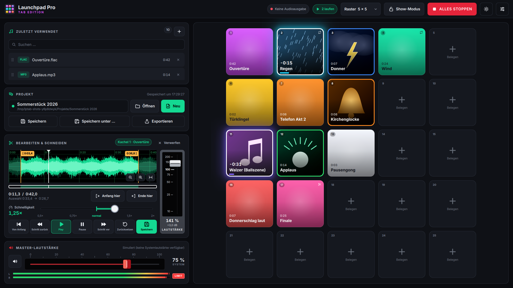

> Die Bilder in dieser Anleitung werden automatisch mit `tools/make_screenshots.py` aus der echten
> Anwendung erzeugt. Sie entstanden auf einem Build-Rechner **ohne Soundkarte** – deshalb steht oben
> „Keine Audioausgabe“ und beim Master-Fader „Simuliert“. Auf einem normalen Windows-PC erscheinen
> dort das Audiogerät (z. B. „Lautsprecher (Windows WASAPI) · 48,0 kHz · 10 ms Latenz“) und die echte
> Windows-Lautstärke.

---

## Inhalt

1. [Funktionen im Überblick](#funktionen-im-überblick)
2. [Installation](#installation)
   - [Windows (Installer)](#windows-installer)
   - [Linux (Programmpaket)](#linux-programmpaket)
   - [Deinstallation](#deinstallation)
   - [Start mit Python (für Entwickler)](#start-mit-python-für-entwickler)
3. [Updates](#updates)
4. [Bedienungsanleitung](#bedienungsanleitung)
   - [Aufbau der Oberfläche](#aufbau-der-oberfläche)
   - [Projekte](#projekte)
   - [Kacheln belegen](#kacheln-belegen)
   - [Abspielen](#abspielen)
   - [Raster ändern](#raster-ändern)
   - [Bearbeiten & Schneiden](#bearbeiten--schneiden)
   - [Master-Lautstärke](#master-lautstärke)
   - [Darstellung: Dunkel und Hell](#darstellung-dunkel-und-hell)
   - [Einstellungen](#einstellungen)
   - [Tastenkürzel](#tastenkürzel)
5. [Speichern, Sicherheit und Projektordner](#speichern-sicherheit-und-projektordner)
6. [Unterstützte Formate](#unterstützte-formate)
7. [Fehlerbehebung](#fehlerbehebung)
8. [Für Entwickler: Technik & Architektur](#für-entwickler-technik--architektur)
9. [Neue Version veröffentlichen](#neue-version-veröffentlichen)
10. [Lizenzen der verwendeten Komponenten](#lizenzen-der-verwendeten-komponenten)

---

## Funktionen im Überblick

| Bereich | Funktion |
|---|---|
| **Kachel-Raster** | 3×3 bis 7×7 Kacheln (Dropdown), eigene Farbe, Titel und Coverbild je Kachel, Leuchten + Restzeit + Fortschrittsbalken während der Wiedergabe |
| **Abspielen** | Linksklick/Tippen = Start, erneut = Stopp (mit kurzem Fade gegen Knackser); mehrere Kacheln gleichzeitig; Schleife je Kachel; **ALLES STOPPEN**; Multi-Touch |
| **Belegen** | Rechtsklick/lang drücken öffnet die Auswahlliste (Audio-Datei, Coverbild, Titel, Farbe, Schleife, **Bearbeiten**, **Löschen** mit „Rückgängig“); Drag & Drop aus dem Explorer oder aus der Liste „Zuletzt verwendet“ |
| **Bearbeiten & Schneiden** | Wellenform mit Zeitraster, Ausschnitt wählen, Zoom, Schnelligkeit 0,5×–2,0× **ohne Tonhöhenänderung** (Rastpunkt „normal“), Lautstärke 10 %–200 % per Fader (Rastpunkt 100 %), Vorhören, Speichern auf die Kachel – nicht-destruktiv, jederzeit wieder änderbar |
| **Projekte** | Neu, Öffnen, Speichern, Speichern unter, Export als ZIP; alle Audio- und Bilddateien liegen im Projektordner; zyklisches automatisches Speichern; das letzte Projekt wird beim Start geöffnet; Doppelklick auf eine Projektdatei öffnet sie |
| **Sicherheit** | Speichern beim Schließen, atomares Schreiben + Sicherungskopie, Wiederherstellung einer laufenden Bearbeitung nach einem Absturz, **Show-Modus** (sperrt alle Bearbeitungen während der Vorstellung), nur eine laufende Programminstanz |
| **Master** | Roter, horizontaler Master-Fader für die **Windows-Systemlautstärke**, Stummschalter, Stereo-Pegelanzeige mit LIMIT-Anzeige |
| **Darstellung** | **Dunkel** (blendfrei im Saal), **Hell** (für helle Räume) oder **wie Windows** – Schnellumschalter oben rechts |
| **Installation & Updates** | Windows-Installer (Programmordner, Desktop-/Startmenü-Verknüpfung, Deinstallation samt optionaler Datenlöschung), Linux-Paket; Update-Prüfung beim Start, Installation per Klick mit Prüfsummenkontrolle und automatischem Neustart |
| **Leistung** | Vorab dekodierte Audiodaten (kein Laden beim Antippen), WASAPI-Ausgabe mit ~10 ms Puffer, Dekodieren/Rendern parallel auf mehreren CPU-Kernen, GPU-beschleunigte Oberfläche (Qt Quick) |

---

## Installation

### Windows (Installer)

1. Auf der GitHub-Seite des Projekts unter **Releases** die neueste Version öffnen und unter
   *Assets* **`LaunchpadProTAB-Setup-<Version>.exe`** herunterladen. (*Source code (zip)* fügt
   GitHub automatisch hinzu – das ist nur der Quellcode, kein Installer.)
2. Den Installer starten und dem Assistenten folgen:

| Schritt | |
|---|---|
| **Willkommen** | 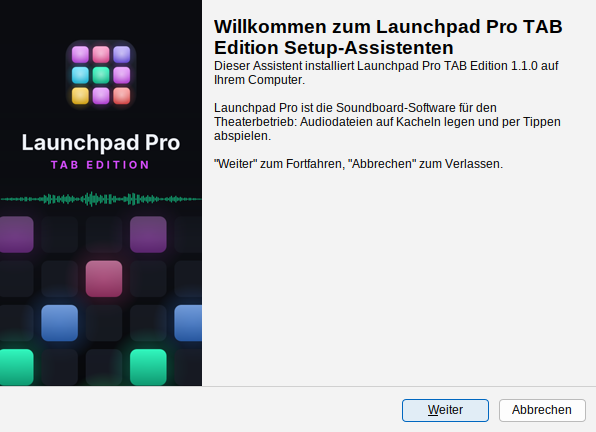 |
| **Zielordner** – Standard ist `C:\Program Files\Launchpad Pro TAB Edition`; über *Durchsuchen …* lässt sich ein anderer Ordner wählen. | 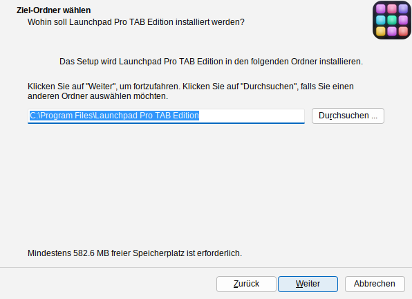 |
| **Zusätzliche Aufgaben** – per Checkbox (alle standardmäßig an): **Desktop-Verknüpfung**, **Eintrag im Startmenü**, **Projektdateien (.lptab) per Doppelklick öffnen**. | 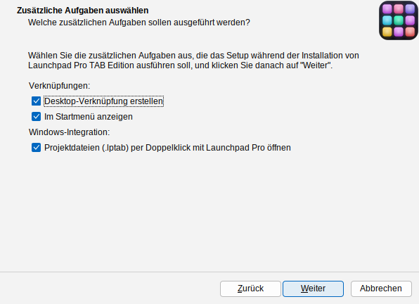 |
| **Bereit** – Zusammenfassung; mit **Installieren** bestätigen. | 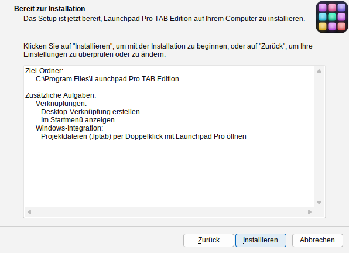 |
| **Fertig** – optional gleich starten. | 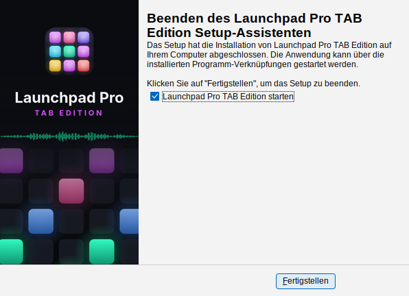 |

Das Programm erscheint danach wie jede Windows-Anwendung im Startmenü, auf dem Desktop und unter
*Einstellungen › Apps › Installierte Apps*. Der Assistent passt sich dem hellen bzw. dunklen
Windows-Design an. (Die Bilder oben stammen aus einer Testumgebung; unter Windows 11 wirkt der
Assistent etwas moderner, Inhalt und Ablauf sind identisch.)

> **Hinweise:** Für die Installation nach `C:\Program Files` fragt Windows nach Administratorrechten.
> Da der Installer nicht digital signiert ist, kann Windows SmartScreen beim ersten Start warnen:
> *Weitere Informationen → Trotzdem ausführen*. Voraussetzung: Windows 10 (Version 1809) oder
> Windows 11, 64 Bit.

Für Administratoren (Verteilung auf mehrere Rechner) funktioniert auch eine stille Installation:

```text
LaunchpadProTAB-Setup-1.1.0.exe /VERYSILENT /SUPPRESSMSGBOXES /NORESTART
LaunchpadProTAB-Setup-1.1.0.exe /VERYSILENT /DIR="D:\Programme\Launchpad" /TASKS="startmenuicon"
```

Zwischenstände (noch nicht veröffentlicht) gibt es unter *Actions → CI → neuester Lauf → Artifacts*:
**LaunchpadProTAB-Windows-Installer** (Installer), **LaunchpadProTAB-Windows** (Programmordner ohne
Installation – entpacken, `LaunchpadProTAB.exe` starten; bietet beim Update an, auf die installierte
Version umzusteigen) und **LaunchpadProTAB-Linux**. GitHub bewahrt sie 30 Tage auf.

### Linux (Programmpaket)

1. Unter **Releases** `LaunchpadProTAB-<Version>-linux-x86_64.tar.gz` herunterladen und entpacken.
2. Im entpackten Ordner `./install.sh` ausführen. Das Skript fragt nach dem Installationsordner
   (Standard: `~/.local/share/launchpad-pro-tab`, keine Administratorrechte nötig) und ob ein
   **Eintrag im Anwendungsmenü**, eine **Desktop-Verknüpfung** und die **Zuordnung für
   Projektdateien** angelegt werden sollen (jeweils Standard: ja).

```bash
tar -xzf LaunchpadProTAB-1.1.0-linux-x86_64.tar.gz
cd LaunchpadProTAB-1.1.0-linux-x86_64
./install.sh            # oder: ./install.sh --yes   (ohne Rückfragen)
```

Voraussetzung: Linux x86_64 mit glibc 2.35 oder neuer (z. B. Ubuntu 22.04, Linux Mint 21,
Debian 12, Fedora 36 und neuer). Als `root` installiert das Skript nach `/opt/launchpad-pro-tab`.

### Deinstallation

**Windows:** *Einstellungen › Apps › Installierte Apps › Launchpad Pro TAB Edition › Deinstallieren*
– oder den Installer erneut starten und **Deinstallieren** wählen. Der Deinstaller fragt per
Checkbox, ob auch **alle Projekte und Einstellungen** gelöscht werden sollen (Standard: **nein** –
Projekte bleiben z. B. für eine Neuinstallation erhalten). Gelöscht werden dabei nur Projektordner,
die mit Launchpad Pro angelegt oder geöffnet wurden; eigene Dateien, die dort zusätzlich liegen, und
exportierte ZIP-Dateien bleiben erhalten.

| Installer erneut gestartet | Deinstallation |
|---|---|
| 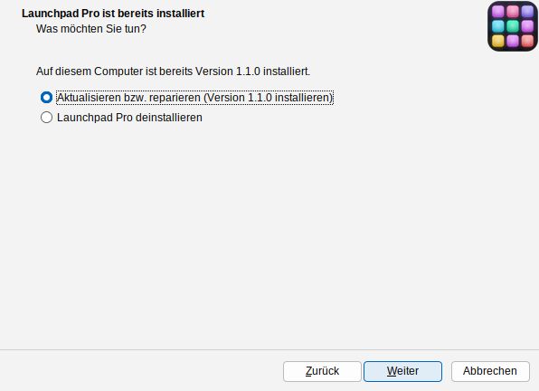 | 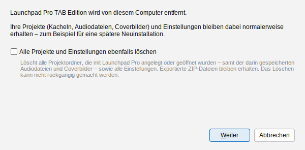 |

**Linux:** `~/.local/share/launchpad-pro-tab/uninstall.sh` – fragt ebenfalls, ob Projekte und
Einstellungen gelöscht werden sollen (Standard: nein). `uninstall.sh --purge --yes` löscht ohne
Rückfrage alles.

### Start mit Python (für Entwickler)

Voraussetzung: **Python 3.10 oder neuer** (empfohlen 3.12) von [python.org](https://www.python.org/downloads/)
– unter Windows bei der Installation den Haken **„Add python.exe to PATH“** setzen.

| System | Start |
|---|---|
| Windows | Doppelklick auf **`start.bat`** |
| Linux / macOS | `./start.sh` |

Beim **ersten Start** wird automatisch eine eigene Python-Umgebung (`.venv`) angelegt und alle
Abhängigkeiten werden installiert (Internetverbindung nötig, dauert 1–2 Minuten).

```bash
python -m venv .venv
.venv\Scripts\activate            # Linux/macOS: source .venv/bin/activate
python -m pip install -r requirements.txt
python -m launchpad_pro_tab
```

Nützliche Startoptionen:

| Option | Wirkung |
|---|---|
| `--fullscreen` | Vollbild (z. B. für ein Touch-Terminal); `F11` schaltet jederzeit um |
| `--project <Pfad>` | bestimmtes Projekt (Ordner, `projekt.lptab` oder Export-ZIP) öffnen – auch ohne `--project` als Dateipfad |
| `--no-audio` | ohne Soundkarte starten (stumm) |
| `--no-update-check` | beim Start nicht nach Updates suchen |
| `--smoke-test` | Selbsttest: Oberfläche laden, Beispieldateien dekodieren, beenden (Code 0 = OK) |
| `--purge-user-data [--yes]` | alle Projekte und Einstellungen löschen (nutzt der Deinstaller); ohne `--yes` wird nur angezeigt, was gelöscht würde |

**Systemvoraussetzungen:** Windows 10/11 (64 bit), 4 GB RAM (8 GB empfohlen), Grafikkarte mit
DirectX 11 (jede Onboard-Grafik der letzten 10 Jahre). Optimiert für Touchscreens ab 1366×768,
ideal 1920×1080.

---

## Updates

Launchpad Pro prüft **beim Start** (und danach alle 12 Stunden) im Hintergrund, ob auf GitHub eine
neue Version veröffentlicht wurde. Ist eine da, erscheint oben in der Kopfleiste der Knopf
**Update x.y.z** und kurz ein Hinweis unten – mitten in einer Vorstellung (Show-Modus) nur der Knopf.
Ohne Internetverbindung passiert einfach nichts.

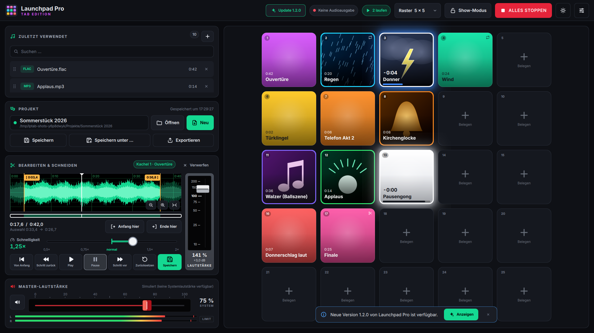

Ein Tipp auf den Knopf zeigt, was neu ist:

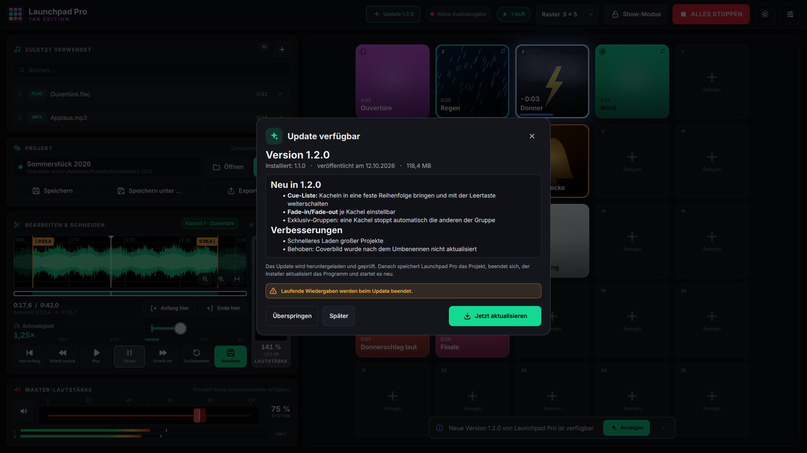

- **Jetzt aktualisieren:** Das Update wird heruntergeladen (mit Fortschrittsanzeige) und per
  **SHA-256-Prüfsumme** geprüft. Danach speichert Launchpad Pro das Projekt und Windows fragt nach
  Administratorrechten. Nach der Bestätigung beendet sich das Programm, der Installer aktualisiert es
  im Hintergrund und startet es anschließend mit demselben Projekt neu. Einstellungen,
  Verknüpfungen und Projekte bleiben erhalten. Wird die Sicherheitsabfrage abgelehnt, läuft
  Launchpad Pro einfach weiter.
  Unter Linux wird der Programmordner ausgetauscht und das Programm neu gestartet.
- **Später:** Der Knopf oben bleibt als Erinnerung.
- **Überspringen:** Diese Version wird nicht mehr angeboten (erst die nächste wieder).
- Im **Show-Modus** ist *Jetzt aktualisieren* gesperrt – laufende Wiedergaben würden beendet.

Unter **Einstellungen › Updates** kann man jederzeit selbst nach Updates suchen, die automatische
Prüfung abschalten (z. B. auf einem Bühnenrechner ohne Internet) oder **Vorabversionen (Beta)**
zulassen, um neue Funktionen vor der Freigabe zu testen.

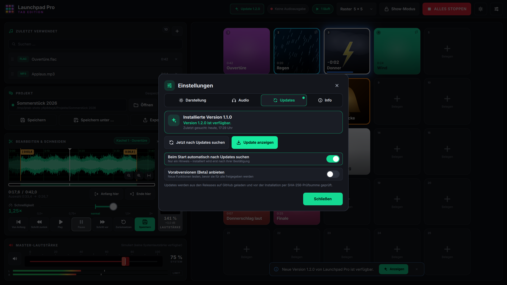

> Die Updates kommen aus den **Releases** dieses GitHub-Repositorys. Damit installierte Programme sie
> ohne Anmeldung abrufen können, muss das Repository **öffentlich** sein.

---

## Bedienungsanleitung

### Aufbau der Oberfläche

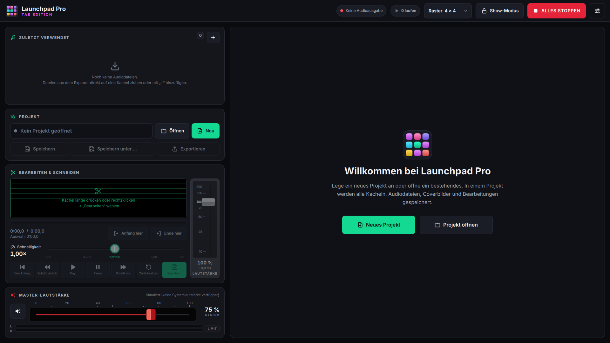

| Bereich | Inhalt |
|---|---|
| **Kopfleiste** | ggf. **Update**-Hinweis, Audio-Status, Anzahl laufender Kacheln, **Raster**-Dropdown, **Show-Modus**, **ALLES STOPPEN**, Hell/Dunkel-Umschalter, Einstellungen |
| **Links oben – Zuletzt verwendet** | zuletzt benutzte Audiodateien (Suche, `+` zum Hinzufügen, `×` zum Entfernen) |
| **Links – Optionen** | **Projekt**, **Bearbeiten & Schneiden**, **Master-Lautstärke** |
| **Rechts – Kachel-Raster** | die Launchpad-Kacheln |

Beim allerersten Start erscheint rechts der Willkommensbildschirm mit **Neues Projekt** und
**Projekt öffnen**. Ab dann wird beim Start immer das zuletzt benutzte Projekt geladen.

Auf kleineren Bildschirmen (z. B. 1366×768) passt nicht alles untereinander – dann lässt sich die
linke Spalte mit dem Finger (oder Mausrad) scrollen. Das Kachel-Raster bleibt immer vollständig
sichtbar.

### Projekte

Oben im Bereich **Projekt** stehen der Name des aktuellen Projekts, der Ablageort und der
Speicherstatus („Gespeichert um 14:32“).

| Schaltfläche | Funktion |
|---|---|
| **Öffnen** | Liste der zuletzt geöffneten Projekte; **Durchsuchen …** öffnet Projektordner (`projekt.lptab`) oder exportierte Projekte (`.zip`, werden automatisch entpackt) |
| **Neu** | Pop-up mit **Projektname**, **Ablageort** und **Kachelanzahl** – unten links **Abbrechen**, unten rechts **Projekt erstellen** |
| **Speichern** | sofort speichern (zusätzlich zum automatischen Speichern) |
| **Speichern unter …** | komplettes Projekt (inkl. Audio, Cover, Bearbeitungen) in einen gewählten Ordner kopieren und dort weiterarbeiten |
| **Exportieren** | ganzes Projekt als **ZIP-Datei** (zum Weitergeben, Sichern oder Umziehen auf einen anderen PC) |

Nach der Installation genügt auch ein **Doppelklick auf `projekt.lptab`** im Explorer. Läuft
Launchpad Pro bereits, öffnet das laufende Programm das Projekt (es startet kein zweites).

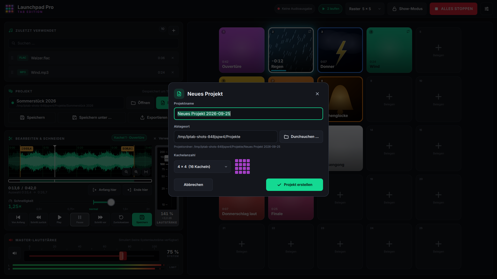

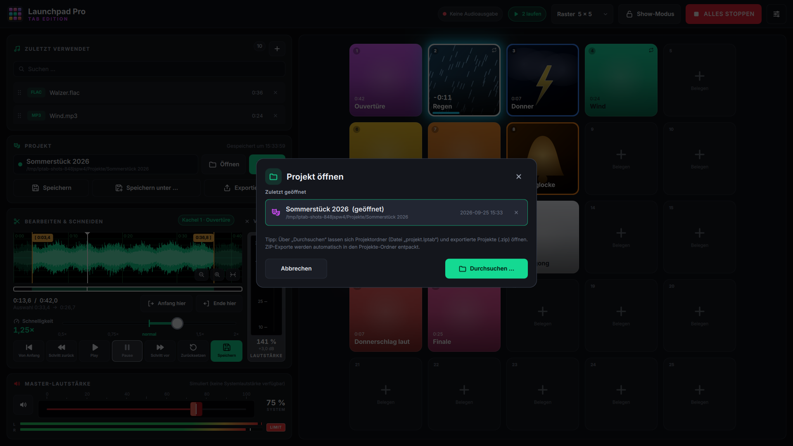

### Kacheln belegen

Es gibt drei Wege, eine Kachel mit Musik zu belegen:

1. **Rechtsklick** (Maus) oder **lange drücken** (Touch, ca. ½ Sekunde – ein Ring zeigt den
   Fortschritt) öffnet die **Auswahlliste** der Kachel. Links stehen die zuletzt verwendeten
   Audiodateien – antippen genügt. Über **Datei durchsuchen …** wählt man eine neue Datei.
   Eine **leere Kachel** öffnet die Auswahlliste schon beim einfachen Antippen.
2. **Drag & Drop aus dem Explorer:** Audiodatei direkt auf die Kachel ziehen. Mehrere Dateien auf
   einmal belegen die Kachel und die jeweils nächsten freien Kacheln.
3. **Drag & Drop aus „Zuletzt verwendet“:** einen Eintrag **waagrecht nach rechts** auf die Kachel
   ziehen (senkrechtes Wischen scrollt die Liste).

Die Audiodatei wird dabei **in den Projektordner kopiert** – das Projekt bleibt vollständig, auch
wenn die Originaldatei später verschoben wird.

In der Auswahlliste lassen sich außerdem einstellen:

- **Coverbild** (JPG, PNG, ICO) – wird automatisch kachelfüllend eingepasst. Alternativ ein Bild
  per Drag & Drop auf eine *bereits belegte* Kachel ziehen.
- **Titel** (ohne Eingabe wird der Dateiname angezeigt)
- **Farbe** (12 Launchpad-Farben)
- **Schleife (Loop)** – die Kachel wiederholt, bis sie erneut angetippt wird
- **Bearbeiten** – öffnet die Spur im Bereich *Bearbeiten & Schneiden*
- **Löschen** – Kachel wird wieder unbelegt (unten erscheint kurz **Rückgängig**)

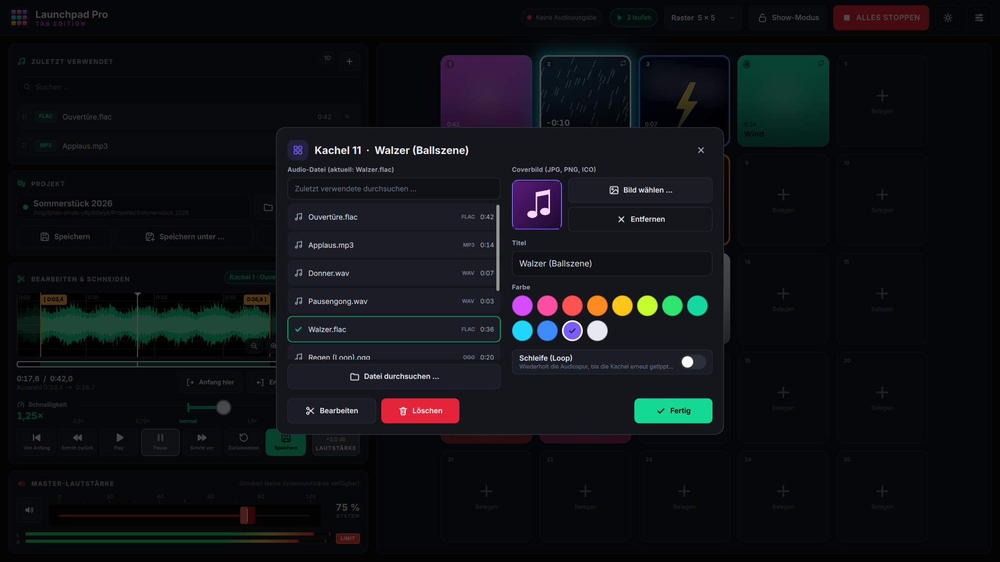

### Abspielen

- **Maus:** Linksklick startet sofort beim Drücken. Erneuter Klick stoppt (mit kurzem Ausblenden).
- **Touch:** kurzes Antippen startet/stoppt. **Mehrere Finger gleichzeitig** funktionieren.
- Beliebig viele Kacheln können **gleichzeitig** laufen (z. B. Regen-Atmo + Donner).
  Ein Limiter schützt dabei vor Übersteuerung (Anzeige **LIMIT** beim Master).
- Laufende Kacheln **leuchten**, zeigen die **Restzeit** und einen **Fortschrittsbalken**.
- **ALLES STOPPEN** (oder Taste `Esc`) beendet alle Kacheln sofort.

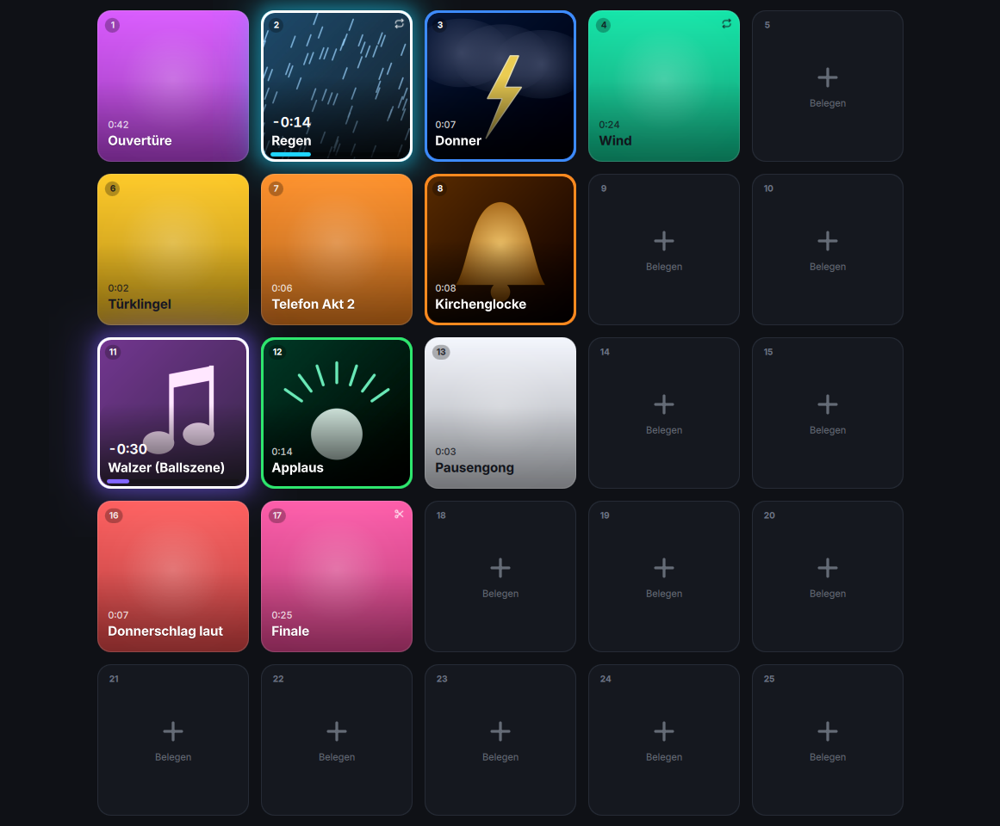

#### Show-Modus (für die Vorstellung)

Der Schalter **Show-Modus** in der Kopfleiste sperrt alles, was während einer Vorstellung nicht
passieren darf: Kein Menü durch versehentliches langes Drücken, kein Drag & Drop, kein Bearbeiten,
kein Rasterwechsel, keine Update-Installation. Zusätzlich lösen Kacheln bei Touch **schon beim
Berühren** aus (noch schneller). Oben erscheint ein gelber Hinweis, solange der Show-Modus aktiv ist.

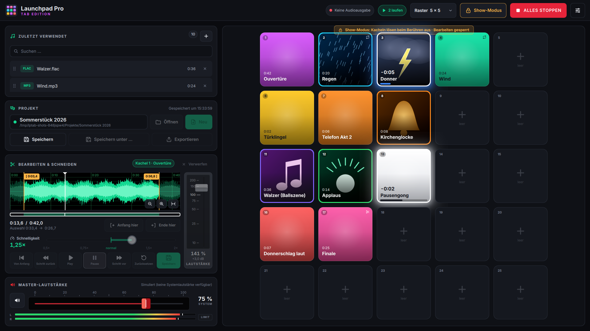

### Raster ändern

Das Dropdown **Raster** in der Kopfleiste stellt 3×3 bis 7×7 Kacheln ein. Beim **Vergrößern** bleiben
alle Kacheln erhalten. Beim **Verkleinern** erscheint immer eine Rückfrage; sie nennt die Zahl der
belegten Kacheln, die außerhalb des neuen Rasters liegen. Mit **Fortfahren** werden deren Inhalte
verworfen, mit **Abbrechen** bleibt alles, wie es war.

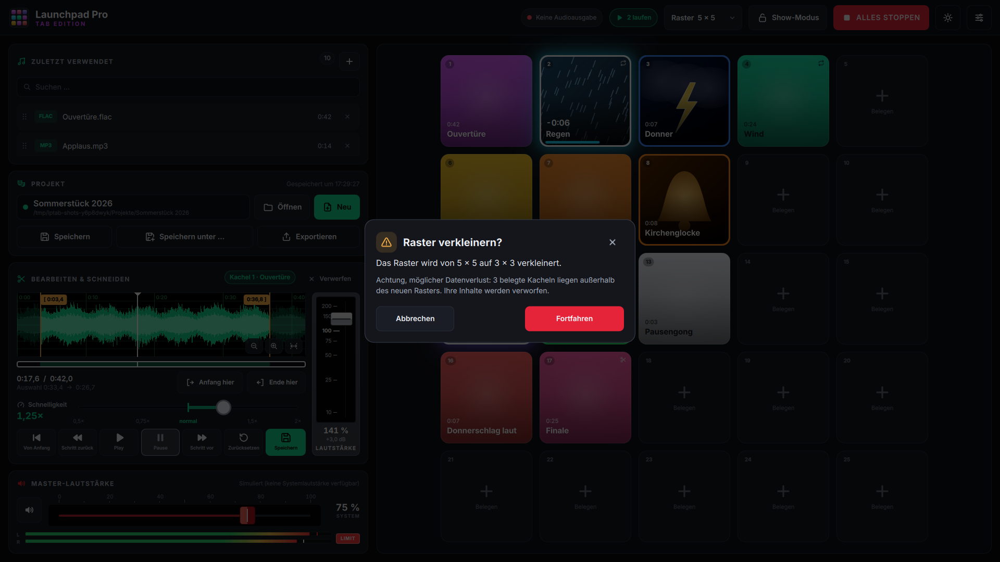

### Bearbeiten & Schneiden

Der Bereich ist ausgegraut, bis in der Auswahlliste einer Kachel **Bearbeiten** gewählt wird.

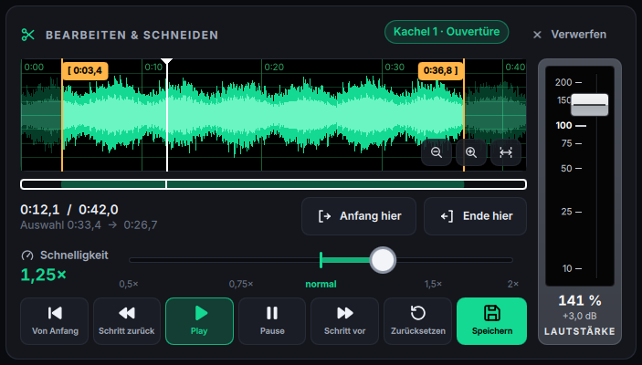

1. **Wellenform:** zeigt die ganze Audiospur (grün mit Zeitraster – im dunklen Design auf Schwarz,
   im hellen auf hellem Grund). Der Bereich zwischen den gelben Markierungen ist die **Auswahl**
   (der Ausschnitt, der später gespielt wird).
   - Gelbe Markierungen **ziehen**, um Anfang und Ende festzulegen.
   - In die Wellenform **tippen** setzt die Abspielposition (Strich mit Raute).
   - **Zoom:** Tasten unten rechts in der Wellenform, zwei Finger (Pinch) oder Mausrad; bei Zoom
     die Wellenform mit einem Finger verschieben. Der Balken darunter zeigt, welcher Teil zu sehen ist.
2. **Anfang hier / Ende hier:** setzt die Auswahl exakt an die aktuelle Abspielposition – ideal
   zum Schneiden „nach Gehör“: abspielen, an der richtigen Stelle **Pause**, **Anfang hier**.
3. **Schnelligkeit:** 0,5× bis 2,0×; die **Tonhöhe bleibt erhalten** (keine „Micky-Maus-Stimme“).
   Der Regler rastet bei **normal** (1,0×) ein; Doppeltippen setzt ihn zurück. Unter den Zeiten
   steht die resultierende Länge („Auswahl 0:33,4 → 0:26,7“).
4. **Tasten:** **Von Anfang** (zum Auswahlanfang), **Schritt zurück / Schritt vor** (1 Sekunde;
   gedrückt halten = Dauerlauf), **Play**, **Pause**, **Zurücksetzen** (alles auf Standard: ganze
   Datei, 1,0×, 100 %).
5. **Lautstärke-Fader** (rechts, Mischpult-Optik): 10 % bis 200 %, rastet bei **100 %** ein;
   Doppeltippen = 100 %. Bei Werten über 100 % verhindert ein Limiter Verzerrungen.
6. **Speichern:** rendert die Bearbeitung und legt sie auf die Kachel. Danach ist der Bereich wieder
   ausgegraut und auf Standardwerte zurückgesetzt. **Verwerfen** (oben rechts) schließt ohne zu
   speichern.

Die Bearbeitung ist **nicht-destruktiv**: Die Originaldatei bleibt unverändert im Projekt, die
bearbeitete Fassung liegt zusätzlich unter `audio/bearbeitet/`. Wird die Kachel später erneut
bearbeitet, erscheinen die bisherigen Einstellungen (Auswahl, Tempo, Lautstärke) wieder und können
angepasst werden – auch nach einem Neustart. Der Zwischenstand einer laufenden Bearbeitung wird alle
5 Sekunden gesichert und nach einem Absturz automatisch wiederhergestellt.

### Master-Lautstärke

Der **rote, horizontale Master-Fader** steuert direkt die **Windows-Systemlautstärke** (dieselbe wie
das Lautsprechersymbol in der Taskleiste). Änderungen von außen (Tastatur-Lautstärketasten)
werden übernommen. Links daneben der **Stummschalter**, darunter die Stereo-Pegelanzeige der App mit
**LIMIT**-Anzeige.

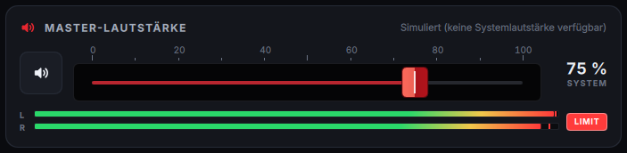

### Darstellung: Dunkel und Hell

Das **dunkle Design** ist für den abgedunkelten Theatersaal gemacht (blendfrei). Für Proben und die
Vorbereitung in hellen Räumen gibt es das **helle Design**:

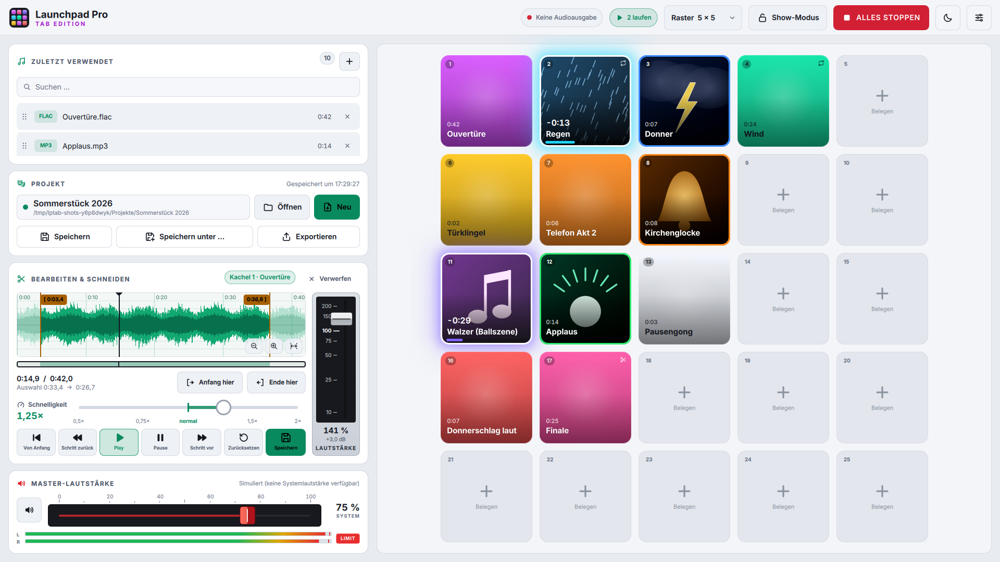

- **Schnellumschalter:** Sonnen- bzw. Mond-Symbol oben rechts neben den Einstellungen.
- **Einstellungen › Darstellung:** **Dunkel**, **Hell** oder **Wie Windows** (folgt automatisch der
  Windows-Einstellung *Farbmodus*; unter Linux der Systemeinstellung). Die Wahl bleibt gespeichert.

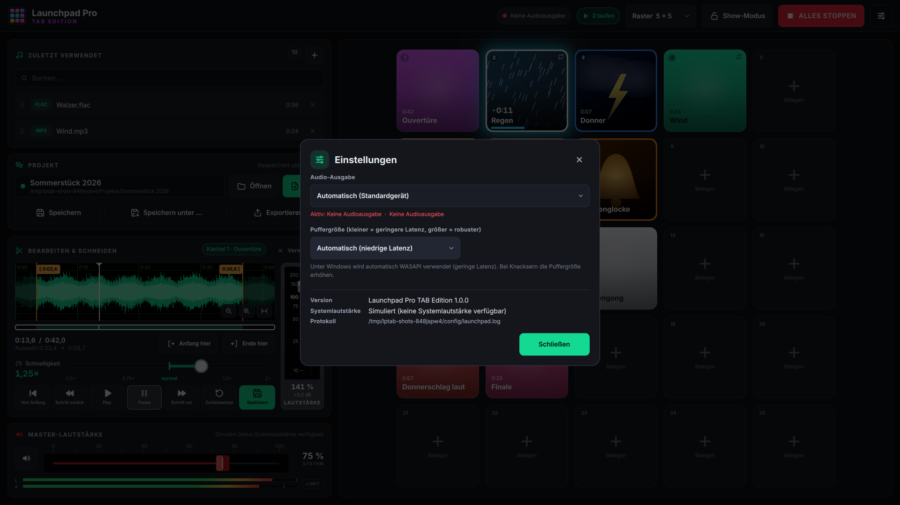

| Bearbeiten im hellen Design | Auswahlliste im hellen Design |
|---|---|
| 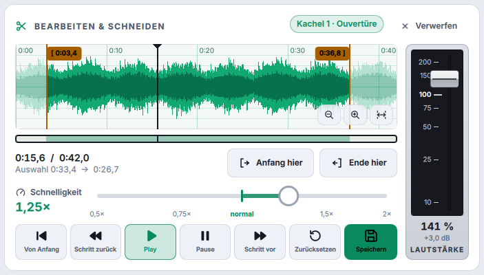 | 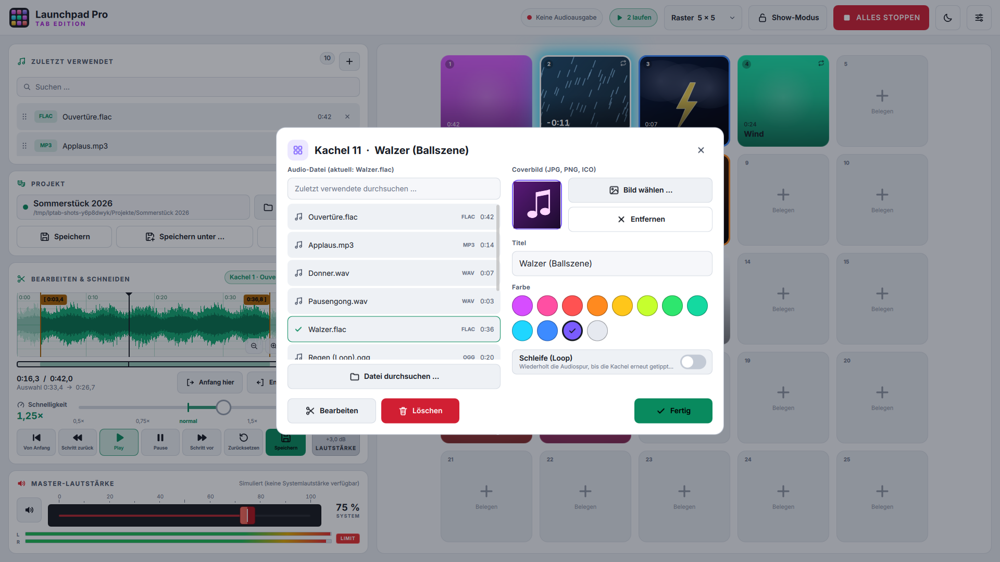 |

### Einstellungen

Über das Regler-Symbol oben rechts – vier Reiter:

- **Darstellung:** Dunkel / Hell / Wie Windows (siehe oben).
- **Audio:** Audio-Ausgabe – Standardgerät (automatisch, unter Windows über WASAPI mit geringer
  Latenz) oder ein bestimmtes Gerät (z. B. USB-Audiointerface des Mischpults). **Puffergröße:**
  *Automatisch* ist die niedrigste stabile Latenz; bei Knacksern auf schwachen Rechnern 512 oder
  1024 wählen.
- **Updates:** jetzt nach Updates suchen, automatische Prüfung beim Start, Vorabversionen (siehe
  [Updates](#updates)).
- **Info:** Version, Installationsart, Systemlautstärke, Protokolldatei, Projekt-Standardordner.

### Tastenkürzel

| Taste | Funktion |
|---|---|
| `Esc` | ALLES STOPPEN |
| `Strg+S` | Projekt speichern |
| `Strg+Umschalt+S` | Speichern unter |
| `Strg+E` | Projekt exportieren |
| `Strg+O` / `Strg+N` | Projekt öffnen / neues Projekt |
| `Leertaste` | Play/Pause im Bereich *Bearbeiten & Schneiden* |
| `F11` | Vollbild ein/aus |

---

## Speichern, Sicherheit und Projektordner

- **Automatisch:** Jede Änderung wird nach 2 Sekunden gespeichert, zusätzlich spätestens alle
  30 Sekunden. Der Status steht im Bereich *Projekt*.
- **Beim Schließen** wird das Projekt immer zuerst sicher gespeichert. Sollte das fehlschlagen
  (z. B. USB-Stick abgezogen), fragt das Programm nach, statt still Daten zu verlieren.
- **Absturzsicher:** Gespeichert wird in eine temporäre Datei, die erst danach die alte ersetzt.
  Die vorherige Fassung bleibt als Sicherung erhalten und wird bei einer beschädigten Projektdatei
  automatisch geladen.
- **Beim nächsten Start** wird das zuletzt geöffnete Projekt automatisch geladen.
- **Vor einem Update** wird das Projekt gespeichert; danach öffnet das Programm es wieder.

Aufbau eines Projektordners:

```text
Sommerstück 2026/
├── projekt.lptab          Konfiguration aller Kacheln (JSON, lesbar)
├── audio/                 Kopien der Original-Audiodateien
│   └── bearbeitet/        gerenderte, bearbeitete Fassungen (FLAC, 24 bit)
├── cover/                 Coverbilder
├── .autosave/             Sicherungen + Zwischenstand der Bearbeitung
└── .cache/                vorbereitete Audiodaten (wird automatisch neu erzeugt, nicht exportiert)
```

| | Windows | Linux |
|---|---|---|
| Neue Projekte (Standard) | `Dokumente\Launchpad Pro TAB\` | `~/Documents/Launchpad Pro TAB/` |
| Einstellungen + Protokoll (`launchpad.log`) | `%APPDATA%\LaunchpadProTAB\` | `~/.config/launchpad-pro-tab/` |
| Update-Downloads | `%LOCALAPPDATA%\LaunchpadProTAB\updates\` | `~/.cache/launchpad-pro-tab/updates/` |
| Programm | `C:\Program Files\Launchpad Pro TAB Edition\` | `~/.local/share/launchpad-pro-tab/` |

---

## Unterstützte Formate

| Art | Formate |
|---|---|
| **Audio** | WAV, FLAC, MP3, OGG/Vorbis, Opus, M4A/AAC, ALAC, WMA, AIFF, AC3, MP2, AMR, WebM/MKA, CAF, W64, sowie die Tonspur von MP4/MOV-Videos (FFmpeg) |
| **Coverbilder** | JPG, PNG, ICO (bei ICO wird automatisch die größte enthaltene Bildgröße verwendet) |
| **Export** | ZIP (ganzes Projekt) |
| **Bearbeitete Spuren** | FLAC, 24 bit, in der Samplerate der Audioausgabe |

Mono-Dateien werden auf beide Kanäle verteilt, Mehrkanal-Dateien (z. B. 5.1) normgerecht auf Stereo
heruntergemischt, abweichende Sampleraten in hoher Qualität umgerechnet.

---

## Fehlerbehebung

| Problem | Lösung |
|---|---|
| Kein Ton, oben steht „Keine Audioausgabe“ | Audiogerät prüfen (angeschlossen? in Windows aktiviert?), dann in den **Einstellungen › Audio** das Gerät neu wählen. |
| Knacksen / Aussetzer | In den **Einstellungen › Audio** eine größere Puffergröße (512 oder 1024) wählen. Energiesparmodus von Windows auf „Höchstleistung“ stellen. |
| Master-Fader zeigt „Simuliert“ | Die Systemlautstärke ist nicht erreichbar (z. B. kein Wiedergabegerät). Der Fader funktioniert dann nur optisch. |
| Kachel zeigt „Datei fehlt“ | Die Audiodatei wurde aus dem Projektordner entfernt. Kachel neu belegen. |
| Datei lässt sich nicht laden | Format beschädigt oder ohne Tonspur – Meldung unten lesen; ggf. Datei in WAV/MP3 umwandeln. |
| Windows warnt beim Installer („Windows hat den PC geschützt“) | Der Installer ist nicht digital signiert: *Weitere Informationen → Trotzdem ausführen*. |
| „Keine veröffentlichten Versionen gefunden“ bei der Update-Suche | Es gibt noch kein Release, oder das GitHub-Repository ist privat. |
| „GitHub-Abfragelimit erreicht“ | Viele Rechner hinter einem Internetanschluss haben kurz nacheinander gesucht – nach einer Stunde erneut versuchen. |
| Update schlägt fehl | Meldung im Update-Dialog lesen; das installierte Programm bleibt unverändert. Protokoll: `%LOCALAPPDATA%\LaunchpadProTAB\updates\installation.log`. Notfalls den Installer von der Release-Seite manuell starten. |
| Linux: Oberfläche startet nicht | Fehlende Systembibliotheken nachinstallieren: `sudo apt install libxcb-cursor0 libxkbcommon-x11-0 libegl1` (meldet auch `install.sh`). |
| Programm startet nicht | `launchpad.log` und `absturz.log` im Einstellungsordner ansehen (siehe Tabelle oben). |

---

## Für Entwickler: Technik & Architektur

**Technologie:** Python 3 + **PySide6 (Qt 6)**, Oberfläche komplett in **Qt Quick/QML**
(GPU-gerendert über Direct3D 11 unter Windows), Audio über **PortAudio/WASAPI** (`sounddevice`),
Dekodierung über **libsndfile** (`soundfile`) und **FFmpeg** (`av`), Resampling mit **soxr**,
DSP mit **numpy**, Windows-Lautstärke über **Core Audio** (`pycaw`), Installer mit **Inno Setup 7**,
Programmpakete mit **PyInstaller**.

```text
┌────────────────────────── QML (launchpad_pro_tab/qml) ──────────────────────────┐
│ Main · TopBar · TileGrid/Tile · RecentList · ProjectSection · EditorSection ·    │
│ MasterSection · TileMenu · Settings/Update-Dialog · Theme (Dunkel/Hell)          │
└──────▲──────────────────────▲─────────────────────▲─────────────────────▲───────┘
       │ Properties/Slots/Signale                    │                     │
┌──────┴─────────────┐ ┌──────┴────────────┐ ┌──────┴────────────┐ ┌──────┴──────────┐
│ bridge.Backend     │ │ bridge.Editor-    │ │ bridge.Update-    │ │ bridge.Master-  │
│ Projekte, Kacheln, │ │ Controller        │ │ Controller        │ │ VolumeController│
│ Drag&Drop, Theme   │ │ Vorschau, Rendern │ │ GitHub, Download  │ │ (eigener Thread)│
└──┬──────────┬──────┘ └──────┬────────────┘ └──────┬────────────┘ └──────▲──────────┘
   │          │ TaskRunner (Prozess-Pool = mehrere CPU-Kerne, Threads für I/O)   │
┌──▼──────┐ ┌─▼───────────────────────────┐ ┌───────▼─────────────┐ ┌──────┴──────────┐
│ core    │ │ audio.tasks: decode → cache,│ │ update: releases,   │ │ system.volume / │
│ Projekt,│ │ render_edit (WSOLA, Limiter)│ │ download (SHA-256), │ │ integration     │
│ Purge   │ └─────────────────────────────┘ │ install (Win/Linux) │ └─────────────────┘
└─────────┘  audio.engine: Mixer im Audio-Thread (PortAudio/WASAPI)  └─────────────────────┘
```

**Maßnahmen für geringe Latenz und hohe Leistung**

- Jede Audiodatei wird **einmalig** im Hintergrund (eigene Prozesse, mehrere Kerne) dekodiert und als
  int16-PCM im `.cache` des Projekts abgelegt. Beim Antippen wird nur eine „Stimme“ im Mixer
  angelegt – keine Datei- oder Dekodierarbeit. Der Anfang jeder Datei wird vorab in den Speicher
  geladen, ein Prefetch-Thread liest laufende Dateien voraus (memory mapping, kaum RAM-Verbrauch).
- Der Mixer läuft im Audio-Thread von PortAudio (WASAPI, „low latency“) und bekommt Befehle über eine
  lock-freie Warteschlange. Mausklicks lösen **beim Drücken** aus.
- Tonhöhenerhaltendes **Time-Stretching (WSOLA)** ist streamingfähig: dieselbe Implementierung
  läuft live in der Vorschau und beim Rendern (was man hört, wird gespeichert). Bei 1,0× arbeitet sie
  bit-genau.
- Die Oberfläche wird von der GPU gezeichnet; Animationen (Leuchten, Fortschritt) laufen im
  Render-Thread. Die Wellenform wird nur bei Zoom/Auswahl/Farbschema neu gezeichnet.
- Die Update-Prüfung läuft in einem Hintergrund-Thread und berührt Audio und Oberfläche nicht.

Gemessene Rechenzeit des Mixers pro Audioblock (48 kHz, Stereo; Messung auf einem Build-Server,
ein moderner PC ist ähnlich schnell). Selbst viele gleichzeitige Kacheln nutzen nur einen
Bruchteil der verfügbaren Zeit – Reserven gegen Aussetzer sind also reichlich vorhanden:

| Szenario | Block | Rechenzeit | Anteil am Zeitbudget |
|---|---|---|---|
| 1 Kachel | 256 Samples (5,3 ms) | 0,04 ms | 0,7 % |
| 8 Kacheln gleichzeitig | 256 Samples (5,3 ms) | 0,10 ms | 1,8 % |
| 16 Kacheln gleichzeitig | 256 Samples (5,3 ms) | 0,19 ms | 3,6 % |
| Vorschau mit Time-Stretch 1,25× | 256 Samples (5,3 ms) | 0,12 ms | 2,3 % |

**Update-Ablauf im Detail**

1. `update.releases` fragt `https://api.github.com/repos/<repo>/releases` ab (ohne Anmeldung),
   ignoriert Entwürfe und wählt die neueste passende Version (`update.version`: `1.2.0`,
   `1.3.0-beta.1` …).
2. `update.install.detect_install_kind()` erkennt die Installationsart (Windows-Installer, portabel,
   Linux-Paket, Quellcode) und damit das passende Release-Paket.
3. `update.download` lädt nur über HTTPS, schreibt zuerst `*.part` und prüft Größe und SHA-256
   (GitHub-Digest bzw. `SHA256SUMS.txt`) – erst dann wird die Datei verwendet.
4. **Windows:** Installer still starten (`/SILENT /LPTABWAITPID=<pid> /LPTABREADY=<datei> /LPTABRESTART=1`).
   Erst wenn der Installer nach der Windows-Sicherheitsabfrage mit Administratorrechten läuft und die
   Bereit-Datei anlegt, beendet sich das Programm – wird die Abfrage abgelehnt, läuft es einfach
   weiter. Der Installer wartet auf das Prozessende (auch der Hintergrundprozesse), ersetzt die
   Dateien und startet das Programm als normaler Benutzer neu. **Linux:** Archiv neben den Programmordner entpacken, die
   *neue* Version übernimmt als Hilfsprozess (`--finish-update`) den Ordnertausch und startet neu;
   ohne Schreibrechte über `pkexec install.sh --update`.

**Schnittstellen (austauschbare Bausteine)**

| Schnittstelle | Implementierungen |
|---|---|
| `audio.output.OutputBackend` | `SoundDeviceBackend` (PortAudio/WASAPI), `NullBackend` (ohne Soundkarte) |
| `audio.decoder.decode()` | libsndfile → FFmpeg (automatischer Fallback) |
| `system.volume.SystemVolume` | `WindowsVolume` (Core Audio), `PulseVolume`, `WirePlumberVolume`, `AlsaVolume`, `MacVolume`, `DummyVolume` |
| `update.install.InstallKind` | Windows-Installer, Windows portabel, Linux-Paket, Quellcode |
| `bridge.Backend` | einzige Schnittstelle der Oberfläche zur Logik (+ `editor`, `master`, `updater`) |

**Projektstruktur**

```text
launchpad_pro_tab/
├── app.py              Start, Einzelinstanz, Logging, Smoke-Test, --purge-user-data
├── core/               Qt-frei: models, project, settings, paths, purge, util, constants
├── audio/              decoder, cache, dsp, timestretch, engine, output, tasks
├── update/             Qt-frei: version, net, releases, download, install
├── system/             volume (Systemlautstärke), integration (Windows-Mutex, Taskleisten-ID)
├── bridge/             backend, editor, updater, appearance, single_instance, models, waveform, …
├── qml/                komplette Oberfläche + icons/ (SVG), Theme.qml (Dunkel/Hell)
└── assets/             Schrift Inter (OFL), Programm-Icon
packaging/
├── launchpad_pro_tab.spec     PyInstaller (Windows-EXE und Linux-Programmordner)
├── windows/LaunchpadProTAB.iss  Inno-Setup-Skript + Assistenten-Bilder
└── linux/install.sh, uninstall.sh
tests/                  pytest (Kernlogik, Audio, Updates, Deinstallation, UI inkl. Maus/Touch)
tools/                  Screenshots, Installer/Linux-Paket bauen und testen, Icons, Versionshinweise
.github/workflows/      build.yml (Tests + Pakete + Installer-Test), ci.yml, release.yml
```

**Entwickeln und prüfen**

```bash
python -m pip install -r requirements-dev.txt
python -m pytest -q                                   # alle Tests (ohne Soundkarte/Bildschirm)
python -m launchpad_pro_tab --smoke-test              # Oberfläche + Dekodierung prüfen
xvfb-run -a -s "-screen 0 1920x1080x24" python tools/make_screenshots.py   # README-Bilder (Linux)
pyinstaller packaging/launchpad_pro_tab.spec --noconfirm                   # Programmordner
python tools/build_installer.py                       # Windows: Installer (braucht Inno Setup 7)
python tools/build_linux_package.py                   # Linux: .tar.gz mit install.sh
sh tools/test_linux_package.sh dist/LaunchpadProTAB-*-linux-x86_64.tar.gz  # Paket-Test (Linux)
```

Weitere Hinweise für die Weiterentwicklung (auch mit Claude Code) stehen in [`CLAUDE.md`](CLAUDE.md).

---

## Neue Version veröffentlichen

1. Versionsnummer in `launchpad_pro_tab/__init__.py` erhöhen (z. B. `1.2.0`) und in
   [`CHANGELOG.md`](CHANGELOG.md) einen Abschnitt `## [1.2.0] – Datum` mit den Neuerungen anlegen.
   Dieser Text erscheint später im Update-Dialog.
2. Committen, pushen und warten, bis **CI** grün ist.
3. Tag setzen und pushen:

   ```bash
   git tag v1.2.0
   git push origin v1.2.0
   ```

   Ohne git auf dem eigenen Rechner geht das auch auf GitHub: *Releases › Draft a new release* →
   bei *Choose a tag* `v1.2.0` eintippen und *Create new tag on publish* wählen, als *Target* den
   Zweig mit dem Code auswählen, Titel z. B. „Launchpad Pro TAB Edition 1.2.0“ → *Publish release*.
   Der Workflow ergänzt anschließend Installer, Linux-Paket, Prüfsummen und Versionshinweise.
   (Sobald der Workflow im Standardzweig liegt, geht es auch über *Actions › Release › Run workflow*.)
4. Der Workflow **Release** baut Windows-Installer und Linux-Paket, testet beide, erstellt die
   Prüfsummen (`SHA256SUMS.txt`) und veröffentlicht das GitHub-Release. Versionen mit Buchstaben
   (z. B. `1.3.0-beta.1`) werden als **Vorabversion** veröffentlicht und nur Programmen angeboten,
   bei denen *Vorabversionen (Beta)* eingeschaltet ist.
5. Alle installierten Programme zeigen das Update beim nächsten Start an.

Der Tag muss zur Versionsnummer im Code passen – sonst bricht der Workflow ab (sonst würde das
Programm nach dem Update immer wieder dieselbe Version anbieten).

---

## Lizenzen der verwendeten Komponenten

Siehe [`THIRD_PARTY_NOTICES.md`](THIRD_PARTY_NOTICES.md). Alle Klänge und Bilder in den Screenshots
sind synthetisch erzeugt (`tools/demo_assets.py`).
